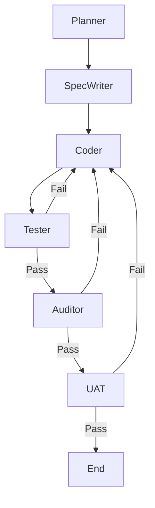

# Autonomous Development Environment (AC-CDD)

An AI-native development environment implementing **Cycle-based Contract-Driven Development**.
Powered by **LangGraph** and **E2B Code Interpreter**.

## Architecture

This project uses a State Graph to orchestrate AI agents for planning, coding, testing, and auditing.



### Components

- **LangGraph**: Manages state and flow control (`src/ac_cdd/graph.py`, `src/ac_cdd/state.py`).
- **E2B Code Interpreter**: Safely executes tests and audits in a cloud sandbox (`src/ac_cdd/sandbox.py`).
- **Pydantic AI**: Provides structured agent outputs (`src/ac_cdd/agents.py`).

## Setup

1. **Install uv**:
   ```bash
   curl -LsSf https://astral.sh/uv/install.sh | sh
   ```

2. **Install dependencies**:
   ```bash
   uv sync
   ```

3. **Configure Environment**:
   Copy `.env.example` to `.env` and set your API keys.
   ```bash
   cp dev_documents/templates/.env.example .env
   ```

   **Required Keys:**
   - `GEMINI_API_KEY`: For AI Agents.
   - `E2B_API_KEY`: For Sandbox execution (Get one at [e2b.dev](https://e2b.dev)).
   - `LOGFIRE_TOKEN`: (Optional) For observability.

## Usage

### 0. Define Grand Design (Critical)
Before running any automation, you must define **what** you are building.
The agents use `dev_documents/ALL_SPEC.md` as the "Constitution" of your project.

1. **Initialize the Spec**:
   Copy the template if it doesn't exist:
   ```bash
   cp dev_documents/templates/ALL_SPEC.md dev_documents/ALL_SPEC.md
   ```
2. **Write your Requirements**:
   Edit `dev_documents/ALL_SPEC.md`. Describe the project goal, architecture, and feature backlog.
   *The Planner Agent will read this to generate cycle plans.*

### 0.5 Refine Specification (New!)
Convert your raw ideas into a rigorous, structured specification using the **Architect Agent**.

```bash
uv run manage.py refine-spec
```

This will generate `dev_documents/ALL_SPEC_STRUCTURED.md`.
**Review this file!** It will serve as the strict constitution for all subsequent AI agents.

### 1. Plan the Cycle (Two Options)

**Option A: Automated Planning (Default)**
Run `start-cycle` directly. The Planner Agent will read `ALL_SPEC.md` and generate artifacts for you.

**Option B: Manual/Offline Planning (Recommended)**
For complex features, you may want to co-design the spec with a superior model (e.g., Gemini Advanced, ChatGPT o1) before starting.

1. Copy the prompt: `dev_documents/templates/CYCLE_PLANNING_PROMPT.md`
2. Chat with an LLM and paste `ALL_SPEC.md`.
3. Save the output files to `dev_documents/CYCLExx/` (`SPEC.md`, `schema.py`, `UAT.md`).
4. Run:
   ```bash
   uv run manage.py start-cycle 01
   ```
   *The tool will detect existing files and skip the planning phase.*

### 2. Start Development Cycle
```bash
uv run manage.py start-cycle 01
```
This will:
1. **Read `ALL_SPEC.md`** (or use existing `SPEC.md`).
2. Generate property tests.
3. Implement code.
4. Run tests in E2B Sandbox.
5. Audit code (Static Analysis + LLM).
6. Run UAT in E2B Sandbox.

### Create a New Cycle
```bash
uv run manage.py new-cycle 02
```

### Ad-hoc Commands
- **Audit**: `uv run manage.py audit` (Review git diffs)
- **Fix**: `uv run manage.py fix` (Fix failed tests)
- **Check Env**: `uv run manage.py doctor`

## Development Flow

See [DEV_FLOW.md](./DEV_FLOW.md) for detailed architecture diagrams.
