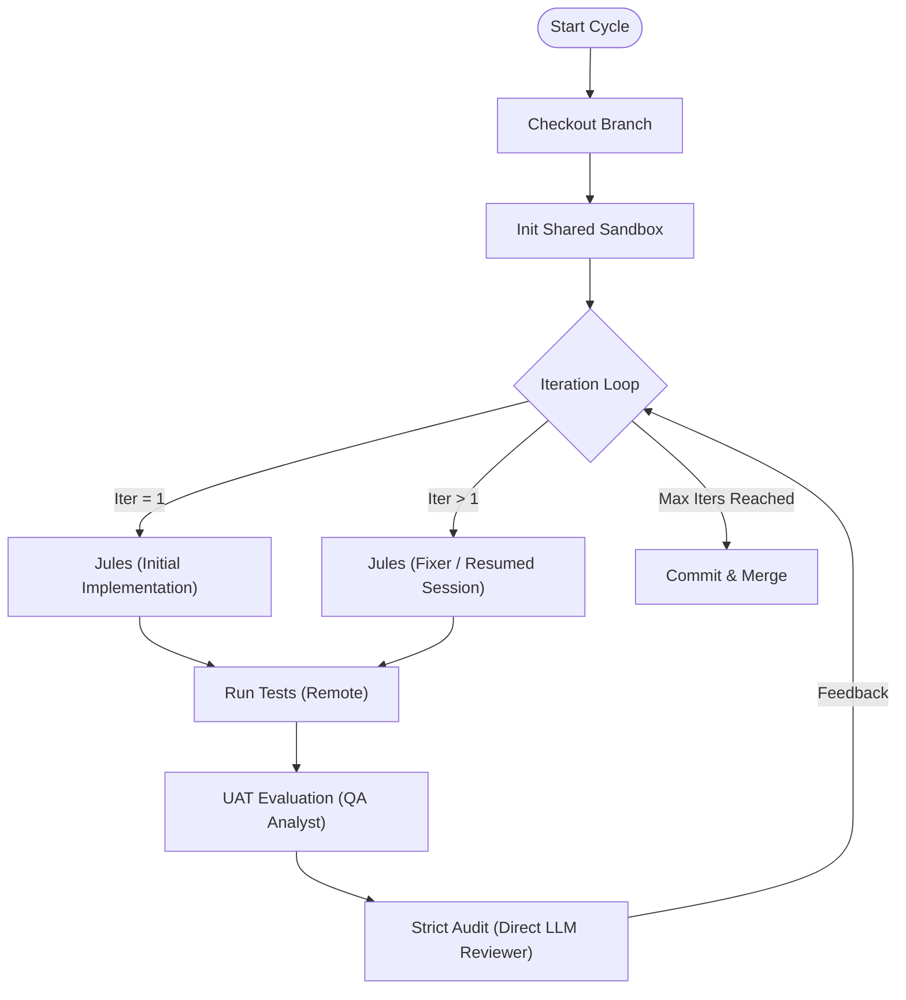

# AC-CDD Internal Development Flow

This document explains the internal architecture, logic, and resources used by the AC-CDD agent system.
It is designed to provide complete transparency into "who is doing what" during the development lifecycle.

## 🏗 System Architecture

AC-CDD utilizes a **Hybrid Agent System** orchestrated by **LangGraph**. It combines the autonomous capabilities of Google's Jules API for implementation and fixing with **LLMReviewer** for direct API-based code auditing.
Crucially, all testing and validation occurs within a secure **E2B Sandbox** to ensure isolation and consistency.

### Role & Tool Mapping

| Role | Tool / API | Model Configuration | Responsibility | Execution Environment |
|---|---|---|---|---|
| **Architect** | **Google Jules API** | Standard Jules Model | Analyzes requirements (`ALL_SPEC.md`), designs architecture, and generates `SPEC.md` and `UAT.md`. Operates in a text-only mode. | Cloud (Jules Session) |
| **Coder (Initial)** | **Google Jules API** | Standard Jules Model | Performs the **Initial Implementation** (Iteration 1). Scaffolds the project from scratch. | Cloud (Jules Session) |
| **Coder (Fixer)** | **Google Jules API** | Standard Jules Model | Handles **Refinement & Repair** (Iteration > 1). Resumes the session to fix issues identified by the auditor. | Cloud (Jules Session) |
| **Auditor** | **LLMReviewer (Direct API)** | `FAST_MODEL` (e.g., Gemini Flash/Llama 3) | Strictly reviews code in **Read-Only** mode. Uses direct LLM API calls (via litellm) to analyze files and generate strict feedback. | Local / Direct API |

## 🔄 Detailed Workflow Logic

The system operates in two main phases: **Architecture** and **Coding**.

### 1. Architect Phase (`gen-cycles`)
*   **Input**: `dev_documents/ALL_SPEC.md` (User Requirements)
*   **Process**:
    1.  **JulesClient** initiates a session with the Architect Persona (`ARCHITECT_INSTRUCTION.md`).
    2.  Jules analyzes requirements and outputs design documents in a strict `FILENAME:` format.
    3.  The client parses these blocks and writes them to disk.
*   **Output**: `SYSTEM_ARCHITECTURE.md`, `CYCLE{xx}/SPEC.md`, `CYCLE{xx}/UAT.md`.

### 2. Coder Phase (`run-cycle --auto`)
This phase uses a **Fixed Iteration Loop** (default: 3 rounds) to force continuous improvement.
All heavy lifting (tests, fixing) happens in the **Shared Sandbox**.



#### Step-by-Step Logic
1.  **Iteration 1 (Creation)**:
    *   **Agent**: **Jules**.
    *   **Action**: Reads `SPEC.md` and implements the core logic from scratch in the cloud. The resulting PR is checked out locally, and files are synced to the sandbox.
2.  **Verification**:
    *   **Syntax Check**: `ruff` linting runs inside the **E2B Sandbox** via `SandboxRunner`. This ensures code quality checks run in a clean, consistent environment.
3.  **Strict Audit**:
    *   **Agent**: **LLMReviewer** (Read-Only).
    *   **Execution**: Direct API calls using `FAST_MODEL` via litellm.
    *   **Logic**: Reviews the code against strict quality standards and generates structured feedback.
4.  **Iteration 2+ (Refinement)**:
    *   **Agent**: **Jules** (Fixer).
    *   **Execution**: Resumes the original Jules session with the audit feedback as a prompt.
    *   **Sync**: Modified PR is checked out locally for the next round of verification.
5.  **Completion**:
    *   The loop continues until `MAX_ITERATIONS` (defined in config) is reached.
    *   The final state is committed to the feature branch.

## 🔍 Deep Dive: Core Mechanisms

### Feature 1: The RAD Pipeline (`gen-cycles`)
The "Rapid Application Design" pipeline transforms raw text into structured engineering artifacts without human intervention.
*   **Process**: The `ArchitectGraph` invokes the **Jules Architect**.
*   **Parsing Logic**: `JulesClient` monitors the agent's output stream in real-time. It uses a robust regex (`FILENAME:\s*(.*?)\n\s*` ````) to detect file blocks generated by the LLM.
*   **Result**: This allows the Architect to "write" complex file trees (specs, diagrams, plans) simply by outputting text.

### Feature 2: The Audit Loop (The "Committee")
Instead of a simple "Pass/Fail" check, AC-CDD enforces a **Committee of Auditors** pattern with multiple independent reviews.

*   **Configuration**:
    - `NUM_AUDITORS = 3`: Three independent auditors review the code
    - `REVIEWS_PER_AUDITOR = 2`: Each auditor performs 2 review cycles
    - **Total: 6 audit-fix cycles** per development cycle

*   **The Cycle**:
    1.  **Implementation**: Jules scaffolds the feature in the cloud and creates a PR.
    2.  **Auditor #1, Review 1**: LLMReviewer performs strict audit → Jules fixes
    3.  **Auditor #1, Review 2**: LLMReviewer re-audits → Jules fixes
    4.  **Auditor #2, Review 1**: Fresh perspective audit → Jules fixes
    5.  **Auditor #2, Review 2**: Re-audit → Jules fixes
    6.  **Auditor #3, Review 1**: Final auditor review → Jules fixes
    7.  **Auditor #3, Review 2**: Final re-audit → Jules fixes
    8.  **Commit**: All auditors satisfied, merge to main

*   **Sync**: Since Jules modifies code remotely (in the cloud), the system checks out the updated PR branch locally after each fix to ensure the local repo is always up to date.

### Feature 3: Sandbox Architecture & Persistence
To solve performance bottlenecks, AC-CDD uses a **Shared Sandbox Model**.
*   **Persistence**: Instead of spinning up a new sandbox for every verification run, a single `SandboxRunner` is initialized at the start of a Cycle.
*   **Efficiency**: Dependencies (`uv`, `ruff`) are installed exactly once. Subsequent syncs use tarball compression and hash-based change detection.
*   **Resilience**: The sandbox includes retry logic to handle disconnections and timeouts gracefully.
*   **Isolation**: Verification code never runs locally. All execution happens in the cloud (E2B), protecting the local machine from side effects.

### Feature 4: Jules Session Management
The **Jules Session Management** system enables sophisticated human-in-the-loop workflows and iterative refinement.
*   **Session Lifecycle**: Create session → Poll for completion → Resume with feedback → Repeat.
*   **AUTO_CREATE_PR Mode**: Jules automatically creates Pull Requests when implementation is complete.
*   **Session Resumption**: The same session can be resumed multiple times with new prompts (e.g., audit feedback), allowing Jules to iteratively improve the code.
*   **Human-in-the-Loop**: The system can detect when Jules asks clarifying questions and automatically answer them using the Manager Agent, enabling fully autonomous operation.

## 🤖 Configuration & Resources

The system's behavior is controlled via environment variables and configuration files.

### Environment Variables (`.env`)

| Variable | Usage | Recommended Value |
|---|---|---|
| `JULES_API_KEY` | Authentication for Google Jules API (Architect/Coder/Fixer). | `required` |
| `GEMINI_API_KEY` | Primary key for Gemini Models (LLMReviewer Auditor/QA Analyst). | `optional` (required if not using OpenRouter) |
| `ANTHROPIC_API_KEY` | Primary key for Claude Models (can be used via OpenRouter). | `optional` |
| `OPENROUTER_API_KEY` | Recommended. Unified access to Gemini & Claude models. | `required` (if using OpenRouter) |
| `E2B_API_KEY` | Key for E2B Sandbox Orchestration. | `required` |
| `SMART_MODEL` | Model ID for **Jules Fixer**. High capability required. | `claude-3-5-sonnet-20241022` |
| `FAST_MODEL` | Model ID for **LLMReviewer Auditor**. Speed & Context required. | `gemini-2.0-flash-exp` |

### Configuration Files

*   **`ac_cdd_config.py`**: Central Python configuration.
    *   `MAX_ITERATIONS`: Controls the number of refinement loops (Default: 3).
    *   `AgentsConfig`: Maps `SMART_MODEL`/`FAST_MODEL` to agent configurations.
    *   `SandboxConfig`: Controls timeout, template, and directories to sync (`src`, `tests`, etc.).
*   **`dev_documents/templates/`**: System Prompts (deprecated, moved to `dev_src/ac_cdd_core/prompts/`).
*   **`dev_src/ac_cdd_core/prompts/`**: System Prompts.
    *   `architect.md`: Prompts for Jules (Architect).
    *   `coder.md`: Prompts for Jules (Coder).
    *   `auditor.md`: Prompts for LLMReviewer (Auditor). **Must remain Strict.**
    *   `qa_analyst.md`: Prompts for QA Analyst Agent.

## Why this Architecture?

*   **Fully Remote**: By running verification in the sandbox and implementation in the cloud (Jules), we eliminate "it works on my machine" issues and protect the developer's environment.
*   **Jules**: Excellent at "0 to 1" creation, understanding broad project goals, and iterative refinement through session resumption.
*   **LLMReviewer**: Provides fast, cost-effective, and strictly controlled auditing using direct API calls to various LLM providers (via litellm) without the overhead of a full agent loop.
*   **LangGraph**: Acts as the supervisor, ensuring the process forces rigorous refinement cycles and manages state transitions.
