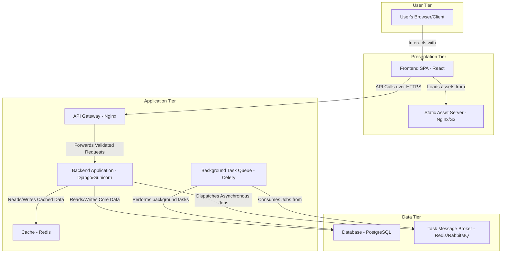

# System Architecture: Zenith Wallet

## 1. Summary

Zenith Wallet is envisioned as a premier personal finance management application, meticulously designed for the modern user who seeks both simplicity and power in managing their financial life. The fundamental goal of this system is to demystify financial management, transforming it from a chore into an empowering and insightful experience. We aim to serve a broad audience, from young professionals taking their first steps in financial planning to seasoned individuals looking for a consolidated view of their assets and liabilities. The application will be a web-based platform, ensuring universal accessibility across desktops, tablets, and mobile devices, thereby providing users with constant access to their financial world. Our core philosophy is to deliver a clean, intuitive, and highly responsive user interface that actively encourages financial engagement and literacy.

The primary problem Zenith Wallet solves is the pervasive sense of anxiety and lack of control many people feel about their finances. This is often caused by fragmented financial data scattered across multiple bank accounts, credit cards, and investment platforms, making it difficult to get a holistic view. Existing solutions frequently fall into two traps: they are either too simplistic, offering little more than basic transaction logging, or they are excessively complex, overwhelming users with jargon and a cluttered interface. Zenith Wallet will carve a niche by striking an optimal balance. It will offer a robust suite of features—including multi-account aggregation, detailed transaction categorization, proactive budgeting, insightful reporting, and investment tracking—all presented through a user-friendly and aesthetically pleasing dashboard. This holistic approach empowers users not just to see where their money went, but to proactively decide where it will go.

The technology stack has been chosen to ensure a secure, scalable, and maintainable platform. The backend will be constructed using Python with the Django framework, a choice motivated by Django's "batteries-included" philosophy which provides a secure Object-Relational Mapper (ORM), built-in protection against common web vulnerabilities, and a mature ecosystem that promotes rapid, yet robust, development. The frontend will be a dynamic Single-Page Application (SPA) developed using a modern JavaScript framework such as React, which allows for the creation of interactive components and a fluid user experience. For the database, we have selected PostgreSQL, renowned for its robustness, reliability, and support for complex queries, which will be essential for our advanced reporting features. This combination of technologies will enable rapid development while building a foundation that can support significant future growth and feature expansion. The development will be phased across two initial cycles. The first will establish the core user and transaction management systems, laying a secure and stable groundwork. The second cycle will build upon this foundation, introducing advanced analytical capabilities like budgeting, comprehensive reporting, and investment tracking, ensuring a steady and reliable rollout of functionality that delivers immediate value to the end-user. This strategic, cycle-based approach is fundamental to our methodology, allowing for iterative feedback, risk mitigation, and a clear focus on delivering a high-quality product.

## 2. System Design Objectives

The design and development of Zenith Wallet are underpinned by a series of precise functional and non-functional objectives. These objectives form the success criteria for the project and guide all architectural decisions, ensuring we build a product that is not only powerful but also safe, reliable, and enjoyable to use.

**Functional Objectives:**
These define the core capabilities and features of the system.
1.  **Unified Financial View:** The system must allow users to connect and aggregate data from various financial accounts, including bank accounts, credit cards, and loans, providing a single, consolidated dashboard of their financial position. This is the cornerstone of the user experience, eliminating the need to log into multiple financial websites.
2.  **Comprehensive Transaction Management:** Users must have the ability to track all their financial activities with minimal effort. This includes automatically importing transactions where possible, manually adding or editing entries with ease, splitting single transactions across multiple categories (e.g., a supermarket bill split into 'Groceries' and 'Household Goods'), and adding custom tags for granular filtering and analysis.
3.  **Proactive Budgeting Tools:** The application must provide flexible and intelligent budgeting tools. Users should be able to create budgets based on historical spending patterns, set custom spending limits for various categories, track their spending against these budgets in real-time, and receive intelligent, user-configurable alerts as they approach their set limits. This transforms budgeting from a reactive exercise into a proactive financial planning tool.
4.  **Insightful Reporting and Analytics:** The system must generate a variety of reports to help users understand their financial habits and progress towards their goals. These should include detailed cash flow analysis, spending breakdowns by category, vendor, and time period, and net worth tracking over time. Crucially, these reports must feature intuitive visualizations (e.g., charts, graphs) to make complex financial data easily digestible and actionable.
5.  **Secure User and Authentication Management:** The system must provide a secure, seamless, and modern process for user registration, login, password management, and multi-factor authentication (MFA) to ensure the highest level of account security and user trust.

**Non-Functional Objectives:**
These define the quality attributes and operational standards of the system, which are just as critical as the features themselves.
1.  **Security:** As a financial application handling sensitive user data, security is the highest priority. The system will employ end-to-end encryption for all user data, both in transit (using modern TLS protocols) and at rest (using AES-256 encryption for the database). All code will be written following secure coding practices (e.g., OWASP Top 10) to prevent common vulnerabilities like SQL injection, XSS, and CSRF. We will conduct regular security audits and penetration testing to proactively identify and mitigate threats.
2.  **Performance & Responsiveness:** The application must feel fast and responsive to the user. API response times for common requests should be under 200ms, and the initial load time for the user interface should be under 2 seconds on a standard broadband connection. This will be achieved through optimized database queries, efficient indexing, and the implementation of a caching layer (using Redis) for frequently accessed data to minimize latency.
3.  **Scalability:** The architecture must be designed from the ground up to handle a growing user base and increasing data volume without performance degradation. The backend will be designed as a set of stateless services where possible, allowing for horizontal scaling by simply adding more application instances behind a load balancer. The database will be configured for scalability with options for read replicas to handle intensive reporting queries, ensuring that analytical workloads do not impact the performance of core transaction processing.
4.  **Reliability & Availability:** The system must be highly available and reliable, targeting a 99.9% uptime. This will be achieved through redundant infrastructure across multiple availability zones, automated database backups with point-in-time recovery, and a robust disaster recovery plan. Comprehensive monitoring and alerting will be implemented to detect and address operational issues proactively before they impact users.
5.  **Maintainability & Extensibility:** The codebase must be clean, modular, and well-documented to facilitate easy maintenance and future feature development. We will enforce a strict coding standard and style guide, a clear separation of concerns in the architecture, and a comprehensive suite of automated tests. This discipline ensures that new features can be added and existing ones modified without introducing regressions or incurring significant technical debt.

## 3. System Architecture

Zenith Wallet will be implemented using a classic three-tier architecture, which provides a clear separation of concerns between presentation, business logic, and data storage. This modular approach is a proven strategy that enhances scalability, maintainability, and security by isolating components and defining clear communication pathways between them.



**Tier 1: Presentation Tier (Frontend)**
This tier is the user's direct interface to Zenith Wallet. It will be a Single-Page Application (SPA) built with the React framework. This choice enables the creation of a highly interactive and responsive user experience, where UI updates happen dynamically without requiring full page reloads. The frontend will be responsible for rendering all UI components, managing client-side state (e.g., using Redux or React Query), and handling user input. It will be completely decoupled from the backend, communicating with it exclusively through a well-defined RESTful API over HTTPS. This decoupling is a critical architectural principle, allowing the frontend and backend teams to work and deploy independently. All presentation logic, such as data formatting for display, client-side form validation, and user interaction feedback, will reside in this tier. Static assets (the compiled HTML, CSS, and JavaScript) will be served efficiently by a dedicated web server like Nginx or, for greater scalability, a cloud storage service with a Content Delivery Network (CDN) like Amazon S3 and CloudFront.

**Tier 2: Application Tier (Backend)**
This is the core of the system, responsible for executing all business logic. It will be a monolithic application built with the Django framework, running on a Gunicorn WSGI server. This tier will expose the RESTful API that the frontend consumes. Key responsibilities include:
-   **API Endpoints:** Using Django REST Framework (DRF) to create, secure, and manage all API endpoints for CRUD operations on users, accounts, transactions, budgets, etc. DRF provides a powerful and flexible toolkit for building web APIs.
-   **Authentication & Authorization:** Implementing a robust authentication system using JSON Web Tokens (JWT). Upon successful login, the user receives a token which must be included in the header of all subsequent requests. The backend will validate this token and handle permissions to ensure users can only access their own data.
-   **Business Logic:** Executing all the core logic of the application, such as calculating budget balances, generating report data, and processing transactions. This logic will be encapsulated in service layers to keep the API views clean and focused on request/response handling.
-   **Background Processing:** For long-running or resource-intensive tasks, such as sending email notifications, generating large PDF reports, or potentially connecting to third-party bank APIs in the future, the application will offload jobs to a background task queue managed by Celery. This ensures that the main application remains responsive and does not get blocked by these tasks, leading to a better user experience.
-   **Caching:** A Redis cache will be used to store frequently accessed but rarely changed data, such as user profiles, category lists, or the results of expensive report queries. This significantly reduces database load and improves API response times.

**Tier 3: Data Tier (Persistence)**
This tier is responsible for the persistent storage of all application data.
-   **Primary Database:** A PostgreSQL database will serve as the single source of truth for all core data, including user credentials, accounts, transactions, and budgets. PostgreSQL is chosen for its strong support for data integrity (ACID compliance), advanced querying capabilities, transactional reliability, and proven scalability.
-   **Message Broker:** A message broker (like Redis or RabbitMQ) will be used to facilitate communication between the main Django application and the Celery background workers. When a task needs to be run in the background, the application places a message on the queue, and a Celery worker picks it up for processing. This decouples the task execution from the main application flow.

This architectural design ensures a robust, secure, and scalable system capable of meeting both current requirements and future demands.

## 4. Design Architecture

The internal design of the backend application will be organized around Django's "apps" concept, promoting modularity and reusability. Each major feature or domain of the application will reside in its own dedicated app, creating clear boundaries and making the codebase easier to understand, test, and maintain.

**File Structure:**
The project will be structured to ensure a clear separation of concerns, making it intuitive to navigate and maintain. This structure is a standard, best-practice Django project layout.

```
zenith_wallet/
├── apps/                 # Main container for all Django apps
│   ├── users/            # Handles user management, authentication, profiles
│   ├── transactions/     # Manages accounts, categories, and transactions
│   ├── budgets/          # Manages budget creation and tracking
│   ├── reports/          # Logic for generating financial reports
│   └── investments/      # Manages investment portfolios and assets
├── zenith_wallet/        # Core Django project configuration
│   ├── settings/         # Split settings (base, dev, prod)
│   ├── urls.py           # Root URL configuration
│   └── ...
├── manage.py             # Django's command-line utility
└── tests/                # Project-wide test configuration and shared utilities
```

**Data Models & Schemas:**
The data models are the heart of the application, defined using Django's ORM, which provides an elegant, Pythonic way to interact with the database.
-   **`users.User`**: We will extend the default Django `User` model using a one-to-one relationship to a `UserProfile` model. This allows us to add custom fields like `preferred_currency` and `timezone` without altering the core, battle-tested `User` model.
-   **`transactions.Account`**: Represents a user's financial account (e.g., 'Chase Checking'). Fields will include `name`, `account_type` (e.g., 'Checking', 'Credit Card'), `balance` (using `DecimalField` for financial precision), and a foreign key to the `User`.
-   **`transactions.Category`**: A user-defined category for transactions (e.g., 'Groceries', 'Salary'). It will have a foreign key to the `User` so that categories are user-specific.
-   **`transactions.Transaction`**: The central model representing a single financial event. It will have relationships to `User`, `Account`, and `Category`, and fields like `amount`, `date`, `description`, and `transaction_type` ('Income' or 'Expense').
-   **`budgets.Budget`**: Links a `User` and a `Category` to a specific monetary `amount` for a given time period (e.g., '$500 for Groceries in July 2024').

**API Design:**
The API will be designed following REST principles to ensure predictability and ease of use for the frontend client. This adherence to standards is crucial for maintainability.
-   **Versioning:** All API endpoints will be versioned (e.g., `/api/v1/transactions/`). This is a critical practice that allows us to evolve the API in the future (e.g., creating a `v2`) without breaking existing client applications.
-   **Authentication:** All endpoints (except for login/register) will require a valid JWT token to be passed in the `Authorization: Bearer <token>` header.
-   **Resource-Oriented URLs:** URLs will be structured around resources they expose (e.g., `/api/v1/accounts/`, `/api/v1/accounts/{id}/`). This makes the API intuitive and self-documenting.
-   **Standard HTTP Methods:** We will use standard HTTP verbs for actions: `GET` for retrieval, `POST` for creation, `PUT`/`PATCH` for updates, and `DELETE` for removal. This is a core tenet of RESTful design.
-   **Consistent JSON Responses:** Responses will follow a consistent format, likely using a standard like JSend (`{ "status": "success", "data": { ... } }` or `{ "status": "fail", "data": { ... } }`). This predictability simplifies client-side error handling and data parsing.

## 5. Implementation Plan

The project will be developed in two distinct, sequential cycles, each with a clear focus and set of deliverables. This iterative approach allows us to manage complexity, incorporate feedback, and deliver value incrementally.

**CYCLE01: Core Functionality & Foundation (Estimated Time: 4-6 weeks)**
This cycle focuses on building the essential, non-negotiable features of the application. The goal is to have a functional, secure, and well-tested backend that allows users to manage their basic financial data. This foundation must be solid, as everything else will be built upon it.
-   **Week 1: Project & Auth Setup.** Initialize the Django project and the `users` app. Configure the database connection. Implement the user model, JWT-based registration, login, and logout endpoints. Set up the basic testing framework with `pytest` and establish the continuous integration (CI) pipeline to run tests automatically.
-   **Week 2-3: Transaction Management.** Create the `transactions` app. Define the `Account`, `Category`, and `Transaction` models and their database migrations. Build the Pydantic-based serializers for these models to handle strict data validation and serialization. Implement the full set of CRUD API views and URLs for accounts, categories, and transactions, using Django REST Framework's `ModelViewSet` for efficiency.
-   **Week 4: Security & Permissions.** This is a critical phase. Implement robust permission classes for all API views to ensure a user can only ever access and modify their own financial data. This is not negotiable. Write extensive integration tests specifically designed to try and violate these permissions, asserting that the attempts fail as expected. This proves data isolation between users.
-   **Week 5-6: Testing & Refinement.** Write a comprehensive suite of unit and integration tests, aiming for over 90% code coverage for all business logic. Refine the API responses based on initial feedback and ensure all endpoints are well-documented using an auto-generation tool like `drf-spectacular` to create an OpenAPI/Swagger schema. Prepare the necessary infrastructure-as-code (e.g., Dockerfiles, docker-compose) for deployment.
-   **Deliverables:** A secure, testable, and fully documented REST API capable of handling user authentication and all core transaction management tasks. A CI/CD pipeline that automatically tests and can deploy the application.

**CYCLE02: Advanced Features & Financial Insights (Estimated Time: 5-7 weeks)**
This cycle builds upon the foundation of CYCLE01 to deliver the features that provide deep financial insights and make Zenith Wallet a powerful and indispensable tool for users.
-   **Week 1-2: Budgeting Module.** Create the `budgets` app. Design and implement the `Budget` model. Develop the API endpoints for creating, reading, updating, and deleting budgets. The core logic will involve creating an efficient service that can calculate the total spending for a category within a budget's time frame and compare it against the budgeted amount, returning the status in real-time.
-   **Week 3-4: Reporting Engine.** Create the `reports` app. This will be a service-oriented app with minimal models of its own. Develop a `ReportingService` that contains the complex business logic and database queries for generating reports. The first reports will be 'Spending by Category' (with visualizations in mind) and 'Cash Flow'. Implement the API endpoints that take date ranges as parameters and return the aggregated report data, ensuring the queries are optimized for performance.
-   **Week 5: Dashboard & Aggregation.** Design and build the primary dashboard API endpoint. This endpoint will be a workhorse, aggregating data from multiple sources (current account balances, a list of recent transactions, status of all active budgets) into a single, efficient response to power the main user dashboard. This will require careful query optimization to avoid making multiple redundant database calls.
-   **Week 6: Investment Tracking Foundation.** Create the `investments` app. Define the initial models for `InvestmentAccount` and `Asset`. Implement basic CRUD APIs for users to manually add and track their investments (e.g., number of shares, purchase price). Note: Automatic fetching of real-time investment data from third-party APIs is a significant feature planned for a future cycle.
-   **Week 7: Final Testing & Performance.** Write thorough tests for all new features, paying special attention to the accuracy of the reporting and budgeting calculations. Conduct performance testing on the reporting and dashboard endpoints using a tool like Locust to simulate user load. Identify and fix any performance bottlenecks before deployment.
-   **Deliverables:** An enhanced API with complete budgeting, reporting, and basic investment tracking capabilities. A performance-tested and refined application ready for a wider audience.

## 6. Test Strategy

Our test strategy employs the testing pyramid model to ensure comprehensive coverage and rapid feedback. This means a large base of fast and isolated unit tests, a smaller set of more comprehensive integration tests, and a few critical end-to-end tests.

**CYCLE01: Foundational Testing**
The testing in this cycle is paramount to ensure the core of the application is stable and secure.
-   **Unit Tests:** We will use `pytest` to write unit tests for every part of the application in isolation. For models, we will test custom methods and validation rules (e.g., ensuring a transaction amount cannot be negative). For serializers, we will test all validation logic with both valid and invalid data payloads to ensure the API's contract is strictly enforced. For views, we will test the business logic in isolation, mocking the database and authentication where necessary to focus on the view's specific logic. For any service functions or utilities, we will test every function with a range of inputs, including edge cases and invalid data types, to ensure they are robust. We will set a high standard, aiming for a unit test coverage of over 90% for our logic.
-   **Integration Tests:** These tests will verify the interactions between different components of our system. We will use Django's `APITestCase` to write integration tests for our API endpoints. These tests will make real HTTP requests to an in-memory test server and interact with a dedicated test database that is reset after each test. A typical test would involve creating a user, authenticating as that user, creating an account and a transaction via the API, and then asserting that the data is correctly persisted in the database and that subsequent GET requests return the correct data. The most critical integration test will be for permissions: we will create two users, have User A create a resource, and then log in as User B and assert that any attempt to access or modify User A's resource is denied with the correct HTTP status code (403/404).
-   **API Contract Testing:** We will automatically generate an OpenAPI (Swagger) schema from our code using `drf-spectacular`. This schema will serve as a formal contract between the backend and frontend. We will have automated checks in our CI pipeline that ensure our API's behavior always matches this published contract, preventing unintended breaking changes.

**CYCLE02: Advanced Feature Testing**
Testing in this cycle will focus on the correctness of complex financial calculations and the performance of data-intensive features.
-   **Testing Complex Logic:** The reporting and budgeting features introduce more complex business logic. The `ReportingService` will be a particular focus. We will write extensive unit tests for every calculation, using a wide range of data scenarios. For example, we will test the spending report with no transactions, with transactions spanning multiple months (to test date filtering), and with various transaction amounts to verify the correctness of the financial calculations. These tests will be data-driven where possible, using parameterized tests to check many different inputs efficiently.
-   **Integration Tests for Budgets:** We will create integration tests that simulate a full user flow for budgeting. For example, a test will create a budget for "Groceries," then create multiple transactions that fall under that budget's category and date range. It will then hit the budget status API endpoint to assert that the remaining budget calculation is correct. We will also test cases where transactions are updated or deleted and ensure the budget status updates accordingly in real-time. This confirms the tight coupling between the transaction and budgeting systems is working perfectly.
-   **Performance Testing:** The new reporting and dashboard endpoints have the potential to be database-intensive and are prime candidates for performance issues. Before the end of the cycle, we will conduct performance testing on these specific endpoints using a tool like Locust. We will create a script that simulates hundreds of users concurrently requesting their dashboards and reports. We will load the test database with a large, realistic dataset (e.g., a user with several years' worth of transactions) and measure the API response times under this load. This proactive approach allows us to identify and fix any performance bottlenecks (e.g., by adding a database index or a caching layer) before they affect real users.
