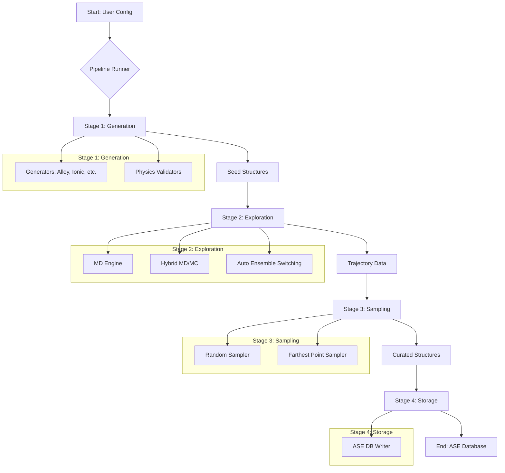

# System Architecture: MLIP Structure Generator

## 1. Summary

The MLIP Structure Generator is a highly sophisticated, physics-informed software tool designed to address a critical bottleneck in modern materials science: the creation of high-quality training data for machine learning interatomic potentials (MLIPs). The core purpose of this system is to automate the generation of physically plausible and structurally diverse atomic configurations that are essential for training robust and accurate models such as MACE and SevenNet. The field of computational materials science is undergoing a paradigm shift, moving from traditional, computationally expensive methods like Density Functional Theory (DFT) to faster, surrogate models based on machine learning. However, the predictive power of these MLIPs is entirely dependent on the quality and diversity of the data they are trained on. Traditional methods for generating such data often rely on extensive manual effort, deep domain expertise, and computationally expensive simulations, which can significantly slow down the materials discovery and design process. This ad-hoc approach often leads to datasets that are biased towards stable, low-energy crystalline structures, leaving the MLIP blind to the high-energy configurations that are frequently encountered in simulations of defects, phase transitions, or fracture mechanics. This project aims to replace that manual, often incomplete process with a systematic, reproducible, and efficient automated pipeline.

The system's design philosophy moves beyond simple random structure generation or mere perturbation of existing crystal structures. It employs a rigorous, simulation-driven approach to explore the thermodynamically accessible phase space of a given material. By utilising established techniques like Molecular Dynamics (MD) and Monte Carlo (MC) simulations, the tool actively seeks out atomic configurations that are most beneficial for training. This includes not only stable, low-energy structures but also, crucially, "failure-prone" configurations. These are high-energy states, transition states, distorted structures, and configurations with defects like vacancies or interstitials that define the boundaries of an MLIP's applicability. By proactively including these challenging configurations in the training set, the resulting potential becomes more stable, accurate, and capable of handling a wider range of simulation conditions, preventing the catastrophic failures that can occur when a simulation encounters a state far from its training distribution. This "active learning" approach, where the system seeks out its own points of failure, is a cornerstone of the design.

To cater to the diverse needs of the materials science community, the generator is architected to support a broad spectrum of physical systems, ensuring its wide applicability. This includes multi-component alloys, where the vast combinatorial space of atomic arrangements makes manual creation impossible; ionic crystals, where the constraint of charge neutrality is paramount; covalently bonded materials like diamond or graphene, which have strong directional bonds; complex interfaces between different materials (heterostructures), which are critical for electronic and structural applications; and surface adsorption phenomena, which are key to catalysis and sensing. Furthermore, it incorporates a "knowledge-based" generation module that can intelligently construct initial structures from minimal input, such as a chemical formula, by leveraging crystallographic databases (like the Crystallography Open Database) and symmetry principles. This feature dramatically lowers the barrier to entry for users who may not be experts in crystallography.

The entire workflow is orchestrated by a central `PipelineRunner` class, which manages a sequential four-stage process: Generation, Exploration, Sampling, and Storage. This modular pipeline ensures a clear separation of concerns, enhances maintainability, and allows for greater flexibility and extensibility. In the Generation stage, initial seed structures are created based on user specifications. The Exploration stage then uses MD or hybrid MD/MC methods to evolve these seeds into a vast ensemble of different atomic arrangements, effectively performing a computational annealing or quenching process. The subsequent Sampling stage intelligently selects a small, information-rich subset of these arrangements using techniques like Farthest Point Sampling (FPS), which ensures maximum structural diversity. Finally, the Storage stage archives the curated dataset into a standardised ASE (Atomic Simulation Environment) database, complete with essential metadata about the generation parameters. This structured, automated approach ensures the creation of superior training datasets, thereby accelerating the development and deployment of next-generation materials potentials.

## 2. System Design Objectives

The primary objective of the MLIP Structure Generator is to streamline and standardise the creation of training datasets for machine learning potentials, empowering researchers to develop better models faster. The design is guided by a set of clear goals, constraints, and success criteria that ensure its utility, robustness, and performance in a real-world scientific research environment. These objectives are not merely technical; they are designed to address the scientific need for more reliable and predictive materials simulations.

**Goals:**
The foremost goal is to **automate the generation of physically realistic and diverse atomic structures**. The system must produce configurations that respect fundamental physical laws, such as quantum mechanical constraints on interatomic distances and electrostatic neutrality in ionic systems, while also covering a wide area of the potential energy surface. This means the tool must go beyond perfect lattices and generate structures with realistic defects, strains, and amorphous characteristics. Secondly, the tool aims to **enhance the quality and robustness of trained MLIPs** by actively seeking out and including high-energy and transition-state structures. This proactive "failure-seeking" is critical for creating potentials that do not fail unexpectedly during complex simulations, such as those involving melting or fracture. The system will be designed to push structures to their physical limits using high temperatures and pressures. A third major goal is to **provide an extensible and user-friendly platform**. The architecture must be modular to allow for the easy addition of new structure generators (e.g., for polymers), new simulation techniques (e.g., Replica Exchange MD), or new sampling algorithms. The platform will offer both a powerful command-line interface (CLI) for expert users and batch processing, and an intuitive web-based graphical user interface (GUI) for ease of use, teaching, and visualisation. Finally, the project seeks to **improve computational efficiency** by incorporating robust, fault-tolerant parallel processing capabilities, allowing it to leverage modern multi-core CPUs and, potentially in the future, GPU clusters to accelerate the exploration process. This includes intelligent handling of large ML models in memory to avoid common bottlenecks in parallel scientific applications.

**Constraints:**
The system operates under several key constraints. It must be **compatible with leading materials science software**, primarily the Atomic Simulation Environment (ASE) for structure representation and interaction with calculators. This ensures interoperability with the broader ecosystem of simulation tools. The MLIP interfaces will target popular frameworks like PyTorch, which underpin models like MACE and NequIP. The software must be **robust against simulation failures**. High-temperature MD simulations are inherently chaotic and prone to numerical instabilities. The system must include sophisticated error handling, atomic overlap safety checks, and crash recovery mechanisms to ensure that long-running, multi-day jobs can complete successfully without losing significant progress. Configuration management must be both **flexible and powerful**, which is addressed by adopting the Hydra framework. This allows users to easily define complex, multi-stage simulation protocols with a clear and hierarchical configuration system that supports easy overriding and composition. Resource management is another critical constraint; the system must be mindful of memory and CPU/GPU usage, especially when handling large ML models in a parallel processing environment. The design must explicitly avoid common pitfalls like pickling large objects to be sent between processes.

**Success Criteria:**
The success of the project will be measured against several key performance indicators. The ultimate criterion is the **quality of the resulting MLIPs**: datasets generated by the tool should consistently train potentials that are more accurate and stable than those trained on manually curated or randomly generated data. This will be quantified by testing the trained MLIPs on a suite of benchmark calculations, such as phonon spectra, elastic constants, and defect formation energies, and comparing the results to DFT calculations. A second criterion is **reduction in user effort and time-to-result**. The tool should demonstrably reduce the time it takes for a researcher to go from a chemical system concept to a fully-fledged training dataset by at least an order of magnitude, from weeks to hours. Thirdly, the system's **robustness and reliability** will be a measure of success. It should be capable of running simulations for hundreds of thousands of timesteps across multiple parallel workers without crashing, and correctly handle and report any unavoidable simulation failures. Finally, the **usability and adoption** of the tool will be a key indicator. Success will be measured by its adoption in research groups, the clarity of its documentation, and the ability for new users to become proficient with its core features within a few hours of use via either the CLI or the Web UI.

## 3. System Architecture

The MLIP Structure Generator is designed as a modular, pipeline-driven system, a common and effective pattern for complex data processing workflows. This architecture promotes a clear separation of concerns, which makes the system easier to understand, maintain, and extend. The entire process is orchestrated by the `PipelineRunner`, a central controller that executes a sequence of four distinct stages: Generation, Exploration, Sampling, and Storage. Each stage is implemented as a self-contained module with a well-defined responsibility, taking data from the previous stage and passing its results to the next.

**System Components:**
1.  **Configuration (Hydra):** At the top level, the system is driven by a configuration module powered by Hydra. This is a critical design choice that separates the system's logic from its parameters. Users can define the entire workflow—from the type of material to the specifics of the simulation and sampling—in structured YAML files. Hydra's ability to compose configuration from multiple files and override parameters from the command line provides immense flexibility and reproducibility, which is essential for scientific computing.

2.  **Pipeline Runner:** This is the central controller (`src/nnp_gen/pipeline/runner.py`). It reads the composed Hydra configuration object, validates it, and then sequentially invokes each of the four main stages. It acts as the "glue" that connects the other modules, managing the flow of data (primarily lists of ASE `Atoms` objects and file paths) between them.

3.  **Stage 1: Generation (`generators/`):** This stage is responsible for creating the initial "seed" structures. It consists of a `BaseGenerator` abstract class that defines a common interface and validation logic, ensuring that all generated structures adhere to basic physical principles before any computationally expensive simulations are run. Specific subclasses implement creation logic for different material types, such as `AlloyGenerator`, `IonicGenerator`, and `InterfaceGenerator`. This object-oriented design makes it straightforward to add support for new material types without modifying the core pipeline. This stage also includes critical physics validators that check for issues like atomic overlap or simulation cells that are too small, preventing simulation failures before they happen.

4.  **Stage 2: Exploration (`explorers/`):** This is the computational core of the system. It takes the seed structures and runs simulations to generate a diverse ensemble of configurations. The `MDEngine` (`md_engine.py`) is the main workhorse, managing the execution of Molecular Dynamics (MD) simulations using ASE calculators. This module contains some of the most complex logic, including support for hybrid MD/MC simulations, where Monte Carlo moves (like atomic swaps) are interspersed with MD steps to more efficiently explore the configuration space. It also features "Auto Ensemble Switching," a crucial feature that intelligently detects the system type (e.g., bulk vs. surface) and automatically selects the appropriate thermodynamic ensemble (NPT vs. NVT) to prevent common simulation artefacts. To ensure stability, it also implements potential mixing, combining the MLIP with a classical potential (ZBL) to handle the high-energy repulsive interactions when atoms get too close. Parallelism is achieved using Python's `ProcessPoolExecutor` to run multiple simulations concurrently.

5.  **Stage 3: Sampling (`samplers/`):** This stage processes the vast trajectory data from the exploration stage—which can often contain millions of structures—to select a smaller, more informative subset for the final dataset. A baseline `RandomSampler` is provided, but the key feature is the `FarthestPointSampler` (FPS). This advanced method uses SOAP (Smooth Overlap of Atomic Positions) descriptors, a type of structural fingerprint, to select a set of structures that are maximally diverse from a geometric perspective. This "smart" sampling ensures that the final dataset is information-rich and avoids redundancy, leading to more efficient MLIP training.

6.  **Stage 4: Storage (`storage/`):** The final stage, where the curated set of structures is saved for future use. The primary storage format is a standard ASE database (backed by SQLite), a common and robust format in the materials science community. This ensures that the output of the generator can be easily used by other tools. Metadata about the simulation parameters is also stored alongside the structures, ensuring traceability and reproducibility of the results.

**Data Flow:**
The data flows linearly through the pipeline, with intermediate results being written to disk to ensure fault tolerance.
1.  The `PipelineRunner` starts with a user-provided **Hydra Config Object**.
2.  The **Generation** stage uses this config to produce a set of **Seed Structures**, which are saved to disk as an `.xyz` file (`initial_structures.xyz`).
3.  The **Exploration** stage takes the seed structures and runs parallel simulations, producing extensive **Trajectory Files**, one for each simulation run. These are also typically in `.xyz` format.
4.  The **Sampling** stage reads all the trajectory files and selects a subset of **Curated Structures**.
5.  The **Storage** stage takes this final list of curated structures and saves them into the final **ASE Database** (`final_dataset.db`).

**Mermaid Diagram:**


## 4. Design Architecture

The software design of the MLIP Structure Generator emphasizes modularity, extensibility, and robustness, following best practices for modern scientific software development in Python. The architecture is built around a set of well-defined classes and modules that interact through clear interfaces, making the system maintainable, testable, and easy to reason about. The use of abstract base classes and a consistent data model (the ASE `Atoms` object) are key pillars of this design.

**File Structure Overview:**
The project follows a standard Python project layout, with application code under `src/`, configuration files in `configs/`, and documentation in `dev_documents/`. This clear separation makes the project easy to navigate.

```
nnp-structure-generator/
├── configs/                  # Hydra configuration files for different systems
│   ├── system/
│   ├── exploration/
│   └── main.yaml
├── dev_documents/            # Project documentation (like this file)
├── src/
│   └── nnp_gen/
│       ├── __init__.py
│       ├── generators/         # Stage 1: Structure generation logic
│       │   ├── base.py         # Abstract Base Class for all generators
│       │   └── ... (alloy.py, ionic.py, etc.)
│       ├── explorers/          # Stage 2: MD/MC exploration logic
│       │   └── md_engine.py    # Core simulation engine and parallel runner
│       ├── samplers/           # Stage 3: Sampling logic
│       │   ├── base.py         # Abstract Base Class for samplers
│       │   └── fps.py          # Farthest Point Sampler implementation
│       ├── storage/            # Stage 4: Database storage logic
│       │   └── db_writer.py
│       ├── pipeline/
│       │   └── runner.py       # Main pipeline orchestrator class
│       ├── common/
│       │   └── physics.py      # Core physics validation functions (e.g., detect_vacuum)
│       └── utils/              # Utility functions (e.g., SOAP descriptor calculation)
├── main.py                   # Command-Line Interface (CLI) entry point
├── main_gui.py               # Web User Interface (UI) entry point
└── pyproject.toml            # Project configuration, dependencies, and linter settings
```

**Key Class and Function Definitions:**
*   **`PipelineRunner` (`pipeline/runner.py`):** This is the central class that orchestrates the entire workflow. Its main public method, `run()`, takes the validated configuration object and executes the four stages in sequence. It is responsible for instantiating the correct generator, sampler, and other components based on the configuration, effectively acting as a factory and controller.

*   **`BaseGenerator` (`generators/base.py`):** An abstract base class that defines the interface for all structure generators. It mandates the implementation of a `generate()` method by its subclasses. Critically, it also contains concrete implementations of shared validation logic, such as `_check_overlap()` and `_ensure_supercell_size()`, which are called by all subclasses to ensure a baseline of physical plausibility for all generated structures.

*   **`MDEngine` (`explorers/md_engine.py`):** This class encapsulates the complex logic for running a single MD or MD/MC simulation. It is initialised with a single `Atoms` object and the relevant simulation parameters. Its `run()` method sets up the ASE `Atoms` object with the correct calculator (e.g., MACE), attaches the dynamics object (e.g., `Langevin`), and runs the simulation. It contains the sophisticated logic for auto-ensemble switching and mixing MLIP and ZBL potentials.

*   **`run_single_md_process()` (`explorers/md_engine.py`):** This is a top-level function designed to be the target for the `ProcessPoolExecutor`. It handles the instantiation of the MLIP calculator and the `MDEngine` *within the worker process*. This is a critical design choice known as "late binding," which avoids the need to pickle and transfer the large, complex ML model from the main process to the workers, a common source of errors and performance issues. It also includes a robust `try...except` block to catch simulation crashes (`PhysicsViolationError`), dump the problematic structure for debugging, and allow the other parallel processes to continue unaffected.

*   **`FarthestPointSampler` (`samplers/fps.py`):** This class implements the FPS algorithm. It takes a trajectory of structures, computes SOAP descriptors for each using a utility module, and then iteratively selects the structure that is farthest in descriptor space from the already selected set. This ensures a geometrically diverse final dataset.

**Data Models and State Management:**
The primary data model in the application is the **ASE `Atoms` object**. This well-established standard from the Atomic Simulation Environment is used to represent all atomic structures, including their atomic numbers, positions, momenta, and the simulation cell. Using this standard object ensures interoperability and leverages the power of the ASE ecosystem.

Configuration state is managed exclusively through **Hydra and OmegaConf**. User settings are defined in `.yaml` files, which Hydra composes into a single, strongly-typed configuration object (potentially backed by Pydantic models for even greater validation). This object is passed down immutably through the various classes and functions, ensuring that all parts of the system are configured consistently and correctly. This approach avoids global state and makes the behaviour of each component explicit and reproducible.

During the exploration phase, intermediate state (the simulation trajectory) is progressively saved to disk in `.xyz` files. This prevents data loss in the event of a system crash. The final, curated state is stored in a transactional SQLite database managed by ASE, which ensures data integrity. Checkpoints and intermediate results are carefully managed to allow for the resumption of interrupted workflows.

## 5. Implementation Plan

The project will be developed over two distinct cycles. Cycle 01 focuses on establishing the core, command-line-driven functionality, delivering a viable, expert-focused tool that is robust and scientifically sound. Cycle 02 builds upon this foundation, adding advanced simulation capabilities, more intelligent data sampling, and a user-friendly web interface to broaden the tool's accessibility to a wider scientific audience. This phased approach allows for iterative development and testing, ensuring a high-quality final product.

**CYCLE01: Core Pipeline and Command-Line Interface**
The primary goal of this cycle is to implement the fundamental end-to-end pipeline, providing a robust and functional tool for expert users via a command-line interface. The focus will be on stability, correctness, and providing essential features for generating baseline datasets. At the end of this cycle, a user will be able to define a simple material system in a configuration file, run the pipeline, and generate a valid, high-quality training dataset.

**Features:**
1.  **Core Pipeline Orchestration:** Implement the `PipelineRunner` class in `pipeline/runner.py`. This class will be responsible for parsing the Hydra config object and sequentially calling the main functions of each of the four stages.
2.  **Basic Structure Generators:** Develop generators for simple, common material types. This will include a `AlloyGenerator` for multi-component alloys and a `CovalentGenerator` for single-element covalent structures (e.g., diamond). These will reside in `generators/alloy.py` and `generators/covalent.py`.
3.  **Fundamental Physics Validation:** Implement the essential physical validation checks within the `BaseGenerator` class. This includes an `overlap_check` to prevent atoms from being unphysically close and `ensure_supercell_size` to guarantee the simulation box is compatible with the potential's cutoff radius.
4.  **Standard MD Exploration Engine:** Build the `MDEngine` class to perform standard Molecular Dynamics simulations using an external MLIP calculator like MACE. This will include support for both NVT (using `Langevin` dynamics) and NPT (using `Berendsen` dynamics) ensembles, which will be manually configured in this cycle.
5.  **Robust Parallel Execution:** Implement the parallel exploration loop within the `PipelineRunner` using Python's `ProcessPoolExecutor`. This includes the critical `run_single_md_process` wrapper function that enables the "late binding" of the calculator in the worker process and includes robust error handling to catch and dump crashing structures without halting the entire process.
6.  **Random Sampling:** Implement a straightforward `RandomSampler` class that selects a user-specified number of structures randomly from the output trajectories. This provides a simple and effective baseline for dataset creation.
7.  **ASE Database Storage:** Develop the storage module (`storage/db_writer.py`) to write the final, sampled structures and their associated metadata (like potential energy) into an ASE-compatible SQLite database.
8.  **CLI and Configuration:** Create the main entry point (`main.py`) using a library like `click` and integrate Hydra to manage all system configurations from YAML files located in the `configs/` directory.

**CYCLE02: Advanced Simulation, Smart Sampling, and Web Interface**
Building on the stable core from Cycle 01, this cycle will introduce advanced features that significantly enhance the quality of the generated data and the user's experience. The goals are to tackle more complex physical systems, improve the intelligence of the data selection process, and make the tool accessible to a broader audience through a graphical interface. This cycle transforms the tool from a utility into a comprehensive platform.

**Features:**
1.  **Advanced Structure Generators:** Implement generators for more complex and scientifically relevant systems. This will include an `IonicGenerator` (with charge-balancing logic), a `InterfaceGenerator` for creating heterostructures, and a `AdsorptionGenerator` for modeling molecules on surfaces. The `Knowledge-based` generator, which can create structures from chemical formulas, will also be developed.
2.  **Hybrid MD/MC Exploration:** Enhance the `MDEngine` to support hybrid simulation modes. This involves implementing a new module, `mc_moves.py`, which will contain functions for Monte Carlo swap moves (for efficient alloy configuration sampling) and vacancy hop moves (to simulate diffusion mechanisms).
3.  **Automated Simulation Control:** Implement the "Auto Ensemble Switching" feature. This requires creating the `detect_vacuum` function in `common/physics.py` and integrating it into the `MDEngine` to automatically select between NPT and NVT ensembles. Also, integrate the ZBL potential mixing logic to prevent high-temperature simulation failures.
4.  **Farthest Point Sampling (FPS):** Implement the `FarthestPointSampler` class. This requires integrating a third-party library (like `dscribe`) to compute SOAP descriptors and then implementing the FPS algorithm itself to enable the creation of maximally diverse datasets. A new utility module, `utils/descriptors.py`, will encapsulate the descriptor calculation.
5.  **Web-based User Interface:** Develop the `main_gui.py` application using a framework like Streamlit or Flask. The UI will provide an intuitive, widget-based interface for building system configurations. It will allow users to launch and monitor generation jobs in the background and will include an integrated 3D molecule viewer to visualise the generated seed structures and final sampled structures.
6.  **Enhanced Safety Mechanisms:** Implement the `Charge Safety` check within the `mc_moves.py` module to prevent invalid swap moves in ionic systems that would violate the fundamental principle of charge neutrality.
7.  **Optimised Resource Management:** Refine the late-binding calculator logic in `run_single_md_process` to include in-process caching of the calculator instance, further reducing the overhead of initialising the potentially large ML model in each worker process.

## 6. Test Strategy

A comprehensive testing strategy will be implemented across both cycles to ensure the correctness, robustness, and reliability of the software. The strategy is divided into unit, integration, and system tests, with a focus on covering the unique physical and computational challenges of the project. All tests will be implemented using the `pytest` framework and will be run as part of a continuous integration pipeline.

**CYCLE01: Core Functionality Testing**
The testing focus for the first cycle is on validating the core pipeline logic, the physical correctness of the outputs for simple systems, and the stability of the parallel execution environment.

*   **Unit Testing:**
    *   **Generators:** Each structure generator (Alloy, Covalent) will be tested in isolation. Tests will verify that the generated structures have the correct composition, lattice type, and number of atoms. For example, a test for the alloy generator will assert that the ratio of elements matches the input specification to within a tight tolerance. Edge cases like 100% composition of one element will also be tested.
    *   **Physics Validation:** The `overlap_check` function will be tested with structures that are known to have overlapping and non-overlapping atoms, ensuring it correctly identifies the invalid cases and raises a specific `PhysicsViolationError`. The `ensure_supercell_size` function will be tested to confirm that it correctly expands the simulation box to meet the cutoff radius requirement in all three dimensions.
    *   **Sampler:** The `RandomSampler` will be tested to ensure it selects the correct number of structures from a dummy trajectory file. We will also test that it handles requests for more samples than are available in the trajectory by raising an appropriate error.
    *   **Configuration:** Unit tests will validate the parsing of different Hydra configuration files, ensuring that default values are applied correctly and that invalid or incomplete configurations (e.g., a covalent generator with no element specified) raise appropriate errors at startup.
    *   **Utilities:** Any utility functions, such as those for applying rattle or strain to `Atoms` objects, will have dedicated unit tests to ensure they modify the structures as expected.

*   **Integration Testing:**
    *   **Pipeline Integrity:** A crucial end-to-end integration test will be created for a simple alloy system (e.g., CuAu). This test will run the entire pipeline from a minimal configuration file, executing the generation, exploration (with a very short MD run of ~10 steps), sampling, and storage stages. The test will then assert that the final ASE database exists, is readable, and contains the expected number of structures. This "smoke test" validates that all components are correctly wired together.
    *   **CLI and Configuration:** Tests will invoke the `main.py` script via a subprocess, passing different valid and invalid configuration files. These tests will check that the application starts correctly, exits with the correct status code (0 for success, non-zero for failure), and produces the expected output files. We will also test Hydra's command-line override feature.

*   **System Testing:**
    *   **Small-Scale Run:** A full, small-scale simulation for a known binary alloy will be run for a few thousand steps. The resulting database of structures will be manually inspected using visualization tools to ensure physical plausibility (e.g., the crystal has not disintegrated at the simulation temperature).
    *   **Parallel Execution:** The system will be tested with `max_workers > 1` to ensure that the parallel exploration functions correctly without race conditions or deadlocks. The final database should contain the correct total number of samples.
    *   **Error Handling:** A system test will be designed to intentionally trigger a `PhysicsViolationError` in one of the workers (e.g., by setting an extremely high temperature). The test will verify that the crashing structure is correctly dumped to a file for debugging and that the overall process completes successfully without the other workers being affected.

**CYCLE02: Advanced Features Testing**
Testing in Cycle 02 will focus on the new, more complex features, ensuring they are both correct in isolation and integrate properly with the existing pipeline. This includes testing the mathematical correctness of algorithms and the usability of the new interface.

*   **Unit Testing:**
    *   **Advanced Generators:** The `IonicGenerator` will be rigorously tested to ensure it always produces charge-neutral structures based on the input oxidation states. The `Interface` and `Adsorption` generators will have tests to verify the correct geometry, such as the thickness of the slab, the distance between slabs, and the position of the adsorbate.
    *   **MD/MC Logic:** The `Swap Move` function will be unit tested to confirm that it correctly swaps two atoms of different types. The `Charge Safety` wrapper for this move will be tested to ensure it correctly prevents swaps that would violate charge neutrality in an ionic system (e.g., swapping a Na+ for a Cl-).
    *   **Physics Utilities:** The `detect_vacuum` algorithm will be a key focus for unit testing. It will be tested with various `Atoms` objects representing bulk, slab, and isolated molecule configurations to ensure it correctly identifies the dimensionality of the system in each case.
    *   **FPS Sampler:** The `FarthestPointSampler`'s mathematical logic will be tested with a small, known set of 2D vectors (representing simplified descriptors). The test will assert that the sampler selects the vectors in the expected order of diversity, thus validating the core algorithm.

*   **Integration Testing:**
    *   **Hybrid MD/MC Pipeline:** An end-to-end integration test will be run for an alloy system using the hybrid MD/MC exploration mode. The output trajectory will be programmatically analyzed to confirm that swap moves have actually occurred (i.e., the composition of atoms in different regions has changed over time).
    *   **Auto-Ensemble Switching:** An integration test will be run on a surface (slab) system with `ensemble: auto`. The test will monitor the simulation log or output to verify that the `MDEngine` correctly identified the system as a surface and automatically switched to the NVT ensemble.
    *   **Web UI Backend:** Integration tests will be created to test the API endpoints or functions that the Web UI calls. These tests will simulate requests from the UI (e.g., to start a job with a given configuration) and verify that the backend pipeline is triggered correctly and that job status updates are correctly reported.

*   **System Testing:**
    *   **Long-Duration Stability:** A high-temperature, long-duration simulation will be run for a complex system (e.g., a ternary ionic compound) to test the overall stability and robustness of the advanced safety features like ZBL potential mixing and charge safety.
    *   **Web UI End-to-End Test:** A full user workflow will be tested through the Web UI. This involves creating a configuration for a complex system, launching the job, monitoring its progress, and inspecting the visualised results. This will serve as a full system test of the GUI and its integration with the backend.
    - **Dataset Quality Assessment:** While not a formal pass/fail test, a key system-level validation will involve using a dataset generated by the tool (using FPS) to train a simple MLIP and evaluating its performance on a small benchmark task (e.g., calculating the bulk modulus of silicon). This provides confidence that the entire system is achieving its primary scientific objective.
