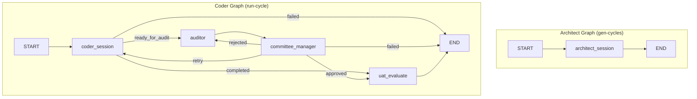

# AC-CDD Development Workflow

Complete workflow documentation including LangGraph flow, branch management, session management, and action details.

---

## Table of Contents

1. [Overview](#overview)
2. [Architecture](#architecture)
3. [Phase 1: gen-cycles (Architecture Generation)](#phase-1-gen-cycles)
4. [Phase 2: run-cycle (Implementation & Audit)](#phase-2-run-cycle)
5. [Branch Strategy](#branch-strategy)
6. [Session Management](#session-management)
7. [Actors & Responsibilities](#actors--responsibilities)
8. [State Flow](#state-flow)

---

## Overview

AC-CDD (Autonomous Cycle-based Contract-Driven Development) is an AI-powered development workflow that:
- Generates architecture and specifications automatically
- Implements features in isolated cycles
- Performs automated code review and quality assurance
- Manages complex branch strategies for safe integration

### Key Components

- **LangGraph**: Orchestrates the entire workflow as a state machine
- **Jules (Google AI)**: Implements code and creates PRs
- **Aider/LLM**: Reviews code and provides feedback
- **StateManager**: Manages project state in local JSON file
- **GitManager**: Handles all Git operations

---

## Architecture

### LangGraph Structure



### Technology Stack

| Component | Technology | Purpose |
|-----------|-----------|---------|
| **Orchestration** | LangGraph | State machine workflow |
| **State Management** | Pydantic + JSON | Type-safe state with local persistence |
| **Code Implementation** | Jules (Google AI) | Autonomous coding agent |
| **Code Review** | Aider + LLM | Automated code review |
| **Git Operations** | GitManager + gh CLI | Branch/PR management |
| **Checkpointing** | MemorySaver | LangGraph state persistence |

---

## Phase 1: gen-cycles

### Purpose
Generate project architecture, specifications, and test plans for all development cycles.

### Command
```bash
ac-cdd gen-cycles --cycles 8
```

### LangGraph Flow

```
START → architect_session → END
```

### Detailed Steps

#### 1. Initialization (workflow.py)

**Actor**: CLI / WorkflowService

**Actions**:
```python
# 1. Build LangGraph
graph = builder.build_architect_graph()

# 2. Create initial state
initial_state = CycleState(
    cycle_id="00",  # Special architect cycle
    project_session_id=session_id,
    planned_cycle_count=8
)

# 3. Execute graph
final_state = await graph.ainvoke(initial_state, config)
```

**State**: `CycleState` (Pydantic model)

---

#### 2. Architect Session Node (graph_nodes.py)

**Actor**: Jules (Google AI)

**Actions**:
1. **Checkout main branch**
   ```python
   await git.checkout_branch("main")
   ```

2. **Call Jules to generate architecture**
   ```python
   result = await jules.run_session(
       prompt="""
       Generate SYSTEM_ARCHITECTURE.md and create SPEC.md + UAT.md 
       for each of the 8 cycles.
       
       Structure:
       - dev_documents/system_prompts/SYSTEM_ARCHITECTURE.md
       - dev_documents/system_prompts/CYCLE01/SPEC.md
       - dev_documents/system_prompts/CYCLE01/UAT.md
       - ... (CYCLE02-08)
       """,
       require_plan_approval=True
   )
   ```

3. **Jules creates branch and PR**
   - **Starting branch**: `feat/generate-architecture-{timestamp}` (we created this)
   - **Jules's branch**: `feat/generate-architectural-documents-{session_id}` (Jules creates this)
   - **PR**: `feat/generate-architectural-documents-{session_id}` → **`main`** ✅
   - **Files**: All SPEC.md and UAT.md files
   
   **How it works**:
   - We checkout `feat/generate-architecture-{timestamp}`
   - Jules uses this as `startingBranch`
   - Jules creates its own branch from this starting point
   - Jules creates PR from its branch to `main` (the base of starting branch)
   
   **Important**: The PR targets `main` because:
   - `feat/generate-architecture-{timestamp}` was created from `main`
   - Jules's `automationMode: AUTO_CREATE_PR` creates PR to the base branch
   - Base branch = `main`

**Output State**:
```python
{
    "project_session_id": "sessions/xxx",
    "integration_branch": "dev/architect-cycle-00-{timestamp}/integration",
    "active_branch": "feat/generate-architecture-{timestamp}",  # Our feature branch
    "pr_url": "https://github.com/.../pull/123"  # Jules's PR to main
}
```

**Branch State**:
```
main
  ↑ (PR #123: feat/generate-architectural-documents-{session_id} → main)
feat/generate-architecture-{timestamp} (our feature branch, for run-cycle)
feat/generate-architectural-documents-{session_id} (Jules's branch, will be deleted after merge)
```

---

#### 3. Post-Processing (workflow.py)

**Actor**: WorkflowService

**Actions**:

##### 3.1 Create Manifest
```python
mgr = StateManager()
manifest = mgr.create_manifest(
    project_session_id=session_id,
    feature_branch="feat/generate-architecture-{timestamp}",
    integration_branch="dev/architect-cycle-00-{timestamp}/integration"
)

# Add cycles
manifest.cycles = [
    CycleManifest(id="01", status="planned"),
    CycleManifest(id="02", status="planned"),
    # ... 08
]

# Save to .ac_cdd/project_state.json
mgr.save_manifest(manifest)
```

##### 3.2 Create Integration Branch
```python
# Create integration branch from main
await git.create_integration_branch(
    session_id,
    branch_name="dev/architect-cycle-00-{timestamp}/integration"
)
```

**Note**: Integration branch is created but **currently unused** in the automated workflow. It's reserved for:
- Future use (e.g., staging environment)
- Manual merging/testing
- Alternative workflow paths

##### 3.3 Merge Architecture to Integration Branch (Optional)
```python
# This step is OPTIONAL and currently for reference only
# The integration branch is not used in run-cycle

# Get Jules's PR branch
jules_branch = "feat/generate-architecture-{timestamp}"

# Checkout integration branch
await git.checkout_branch(integration_branch)

# Merge Jules's branch
await git._run_git([
    "merge", f"origin/{jules_branch}",
    "--no-ff",
    "-m", f"Merge architecture from {jules_branch}"
])

# Push
await git._run_git(["push", "origin", integration_branch])
```

**Result**: 
- ✅ Jules's PR to main contains all SPEC.md files
- ✅ Manifest saved with feature_branch and integration_branch
- ✅ Integration branch created (for future use)
- ✅ Ready for run-cycle (uses feature_branch)

---

### Branch State After gen-cycles

```
main
  ↑ (PR #123 - Jules's architecture PR)
feat/generate-architecture-20260111-1044 (feature branch, will be used for run-cycle)

dev/architect-cycle-00-20260111-1044/integration (created, currently unused)
```

**Important**: 
- `run-cycle` uses `feat/generate-architecture-*` as the base
- Integration branch is created but not actively used
- All cycle PRs target the feature branch

---

## Phase 2: run-cycle

### Purpose
Implement a specific cycle according to its SPEC.md, with automated review and approval.

### Command
```bash
ac-cdd run-cycle --id 01
```

### LangGraph Flow

```
START → coder_session → auditor → committee_manager → [uat_evaluate | auditor | coder_session]
```

### Detailed Steps

#### 1. Initialization (workflow.py)

**Actor**: CLI / WorkflowService

**Actions**:
```python
# 1. Load manifest
mgr = StateManager()
manifest = mgr.load_manifest()

# 2. Checkout feature branch (CRITICAL!)
await git.checkout_branch(manifest.feature_branch)
# Now on: feat/generate-architecture-20260111-1044

# 3. Build LangGraph
graph = builder.build_coder_graph()

# 4. Create initial state
state = CycleState(
    cycle_id="01",
    feature_branch=manifest.feature_branch,
    integration_branch=manifest.integration_branch,
    project_session_id=manifest.project_session_id
)

# 5. Execute graph
final_state = await graph.ainvoke(state, config)
```

---

#### 2. Coder Session Node (graph_nodes.py)

**Actor**: Jules (Google AI)

**Actions**:

##### 2.1 Read SPEC.md and UAT.md
```python
spec_content = read_file("dev_documents/system_prompts/CYCLE01/SPEC.md")
uat_content = read_file("dev_documents/system_prompts/CYCLE01/UAT.md")
```

##### 2.2 Call Jules to implement
```python
result = await jules.run_session(
    prompt=f"""
    Implement CYCLE 01 according to the specification.
    
    SPEC.md:
    {spec_content}
    
    UAT.md:
    {uat_content}
    
    Requirements:
    - Implement all features in SPEC.md
    - Write tests
    - Run tests and save log to dev_documents/CYCLE01/test_execution_log.txt
    - Ensure ruff and mypy pass
    """,
    require_plan_approval=True
)
```

##### 2.3 Jules creates branch and PR
- **Current branch**: `feat/generate-architecture-20260111-1044` (we checked out this)
- **Jules's branch**: `feat/cycle-01-implementation-{session_id}` (Jules creates this)
- **PR**: `feat/cycle-01-implementation-{session_id}` → `feat/generate-architecture-20260111-1044` ✅
- **Files**: Source code, tests, test logs

**How it works**:
- We checkout `feat/generate-architecture-20260111-1044` (feature branch)
- Jules uses this as `startingBranch`
- Jules creates its own implementation branch
- Jules creates PR from its branch to the feature branch (the base)

**Important**: The PR targets the feature branch because:
- `feat/generate-architecture-20260111-1044` is the current branch
- Jules's `automationMode: AUTO_CREATE_PR` creates PR to the base branch
- Base branch = feature branch (not main!)
- This allows cycles to accumulate on the feature branch

**Output State**:
```python
{
    "jules_session_name": "sessions/12345",
    "pr_url": "https://github.com/.../pull/124",  # PR to feature branch
    "status": "ready_for_audit"
}
```

**Routing**: `check_coder_outcome()` → `"ready_for_audit"` → auditor

---

#### 3. Auditor Node (graph_nodes.py)

**Actor**: Aider + LLM (OpenRouter)

**Actions**:

##### 3.1 Get changed files
```python
git = GitManager()
changed_files = await git.get_changed_files(
    base_branch=state.feature_branch  # Compare to feature branch!
)

# Filter out build artifacts
reviewable_files = [
    f for f in changed_files
    if not any(pattern in f for pattern in [
        ".egg-info", "__pycache__", ".pyc", "dist/"
    ])
]
```

##### 3.2 Read files
```python
file_contents = {}
for filepath in reviewable_files:
    content = read_file(filepath)
    file_contents[filepath] = content
```

##### 3.3 Review with LLM
```python
reviewer = LLMReviewer()
result = await reviewer.review_code(
    files=file_contents,
    spec_content=spec_content,
    test_log=test_log_content,
    instruction=auditor_instruction  # From AUDITOR_INSTRUCTION.md
)

# result: AuditResult (Pydantic)
# - is_approved: bool
# - critical_issues: list[str]
# - suggestions: list[str]
# - summary: str
```

**Output State**:
```python
{
    "audit_result": AuditResult(
        is_approved=False,
        critical_issues=["Missing error handling in X"],
        suggestions=["Add type hints to Y"],
        summary="Code needs improvements"
    ),
    "audit_retries": 1
}
```

**Routing**: Always → committee_manager

---

#### 4. Committee Manager Node (graph_nodes.py)

**Actor**: Committee Logic (Code)

**Actions**:

##### 4.1 Check approval status
```python
audit_result = state.audit_result

if audit_result.is_approved:
    # ✅ Approved
    return {"status": "uat_evaluate"}
```

##### 4.2 Check retry limits
```python
if state.audit_retries >= MAX_RETRIES:
    # ❌ Too many retries, auto-approve
    return {"status": "uat_evaluate"}
```

##### 4.3 Send feedback to Jules
```python
# Rejected, send feedback
feedback = f"""
AUDIT FEEDBACK (Iteration {state.audit_retries}):

Critical Issues:
{audit_result.critical_issues}

Suggestions:
{audit_result.suggestions}

Please fix these issues and update the PR.
"""

# Send to existing Jules session
await jules.send_message_to_session(
    session_id=state.jules_session_name,
    message=feedback
)

# Wait for new PR
await jules.wait_for_pr_update(...)
```

**Output State**:
```python
{
    "status": "auditor",  # Loop back to auditor
    "audit_retries": 2
}
```

**Routing**: `route_committee()` → `"auditor"` | `"uat_evaluate"` | `"coder_session"` | `"failed"`

---

#### 5. UAT Evaluate Node (graph_nodes.py)

**Actor**: Placeholder (Future)

**Actions**:
```python
# Currently just a placeholder
console.print("[green]✅ UAT Evaluation (placeholder)[/green]")
return {"status": "completed"}
```

**Output State**:
```python
{
    "status": "completed"
}
```

**Routing**: → END

---

#### 6. Post-Processing (workflow.py)

**Actor**: WorkflowService

**Actions**:

##### 6.1 Update manifest
```python
mgr.update_cycle_state(
    cycle_id="01",
    status="completed",
    jules_session_id=final_state["jules_session_name"],
    pr_url=final_state["pr_url"]
)
```

##### 6.2 Return to feature branch
```python
# Already handled in auditor_node
await git.checkout_branch(manifest.feature_branch)
```

**Result**:
- ✅ Cycle 01 completed
- ✅ PR created and approved
- ✅ Manifest updated
- ✅ Ready for next cycle

---

### Branch State After run-cycle

```
main
  ↓
feat/generate-architecture-20260111-1044 (feature branch)
  ↓
feat/cycle-01-implementation-{session_id} (Jules's PR) → MERGED
  ↓
feat/generate-architecture-20260111-1044 (updated with cycle 01 code)
```

---

## Branch Strategy

### Branch Hierarchy

```
main (production)
  ↓
feat/generate-architecture-{timestamp} (feature branch)
  ↓
feat/cycle-XX-implementation-{session_id} (cycle PRs)
  ↓
dev/architect-cycle-00-{timestamp}/integration (integration branch, unused for now)
```

### Branch Purposes

| Branch | Purpose | Created By | Merged To |
|--------|---------|------------|-----------|
| `main` | Production code | Manual | - |
| `feat/generate-architecture-*` | **Feature branch** (accumulates all cycles) | Jules (gen-cycles) | `main` (manual) |
| `feat/cycle-XX-implementation-*` | Individual cycle implementation | Jules (run-cycle) | Feature branch (auto) |
| `dev/architect-cycle-00-*/integration` | Integration branch (future use) | WorkflowService | - |

### Key Points

1. **Feature Branch is the Base**: All cycle PRs target the feature branch
2. **Accumulation**: Each cycle builds on previous cycles
3. **Isolation**: Each cycle has its own branch and PR
4. **Final Review**: Feature branch → main is manual (human review)

---

## Session Management

### StateManager (Local File)

**Location**: `.ac_cdd/project_state.json`

**Structure**:
```json
{
  "project_session_id": "sessions/xxx",
  "feature_branch": "feat/generate-architecture-20260111-1044",
  "integration_branch": "dev/architect-cycle-00-20260111-1044/integration",
  "cycles": [
    {
      "id": "01",
      "status": "completed",
      "jules_session_id": "sessions/12345",
      "pr_url": "https://github.com/.../pull/124",
      "created_at": "2026-01-11T10:00:00Z",
      "updated_at": "2026-01-11T10:30:00Z"
    },
    {
      "id": "02",
      "status": "planned",
      ...
    }
  ],
  "last_updated": "2026-01-11T10:30:00Z"
}
```

### Operations

| Operation | Method | Sync/Async |
|-----------|--------|------------|
| **Create** | `mgr.create_manifest()` | Sync |
| **Load** | `mgr.load_manifest()` | Sync |
| **Save** | `mgr.save_manifest()` | Sync |
| **Update Cycle** | `mgr.update_cycle_state()` | Sync |

### Resume Session

```bash
# Skip gen-cycles, use existing architecture
ac-cdd resume-session feat/generate-architecture-20260111-1044 --cycles 8
```

**Actions**:
1. Create manifest with existing branches
2. Generate cycle manifests (01-08, all "planned")
3. Save to `.ac_cdd/project_state.json`

---

## Actors & Responsibilities

### 1. CLI (cli.py)

**Role**: User interface

**Responsibilities**:
- Parse commands
- Call WorkflowService
- Display results

**Commands**:
- `gen-cycles`: Generate architecture
- `run-cycle`: Run a cycle
- `resume-session`: Resume from existing branch

---

### 2. WorkflowService (workflow.py)

**Role**: Orchestrator

**Responsibilities**:
- Build LangGraph
- Execute graph with initial state
- Handle pre/post-processing
- Manage StateManager
- Handle Git operations (branch creation, merging)

**Methods**:
- `run_gen_cycles()`: Execute architect graph
- `run_cycle()`: Execute coder graph
- `_run_all_cycles()`: Run multiple cycles

---

### 3. GraphBuilder (graph.py)

**Role**: LangGraph factory

**Responsibilities**:
- Define graph structure
- Add nodes and edges
- Compile graphs with checkpointer

**Methods**:
- `build_architect_graph()`: Create architect graph
- `build_coder_graph()`: Create coder graph

---

### 4. CycleNodes (graph_nodes.py)

**Role**: Node implementations

**Responsibilities**:
- Implement all graph nodes
- Call external services (Jules, Aider)
- Update state
- Route decisions

**Nodes**:
- `architect_session_node()`: Generate architecture
- `coder_session_node()`: Implement code
- `auditor_node()`: Review code
- `committee_manager_node()`: Approve/reject
- `uat_evaluate_node()`: Run UAT (placeholder)

**Routers**:
- `check_coder_outcome()`: Route from coder
- `route_committee()`: Route from committee

---

### 5. Jules (jules_client.py)

**Role**: Code implementation agent (Google AI)

**Responsibilities**:
- Generate code based on SPEC.md
- Create branches and PRs
- Respond to feedback
- Run tests

**Methods**:
- `run_session()`: Start new session
- `send_message_to_session()`: Send feedback
- `wait_for_pr_update()`: Wait for PR update

**API**: Google AI Code Assist API

---

### 6. Aider/LLM (llm_reviewer.py)

**Role**: Code review agent

**Responsibilities**:
- Review code changes
- Identify issues
- Provide suggestions
- Approve/reject

**Methods**:
- `review_code()`: Review files

**Model**: OpenRouter (configurable)

---

### 7. StateManager (state_manager.py)

**Role**: State persistence

**Responsibilities**:
- Save/load manifest
- Update cycle status
- Track session information

**Storage**: `.ac_cdd/project_state.json` (local file)

---

### 8. GitManager (git_ops.py)

**Role**: Git operations

**Responsibilities**:
- Branch operations (create, checkout, merge)
- PR operations (create, update)
- File operations (diff, changed files)

**Tools**: `git` CLI, `gh` CLI

---

## State Flow

### CycleState Fields

```python
class CycleState(BaseModel):
    # Identity
    cycle_id: str
    project_session_id: str | None
    
    # Branches
    feature_branch: str | None          # Main development branch
    integration_branch: str | None      # Integration branch
    active_branch: str | None           # Current working branch
    
    # Jules Session
    jules_session_name: str | None      # Jules session ID
    pr_url: str | None                  # PR URL
    
    # Audit State
    audit_result: AuditResult | None    # Review result
    audit_retries: int                  # Retry count
    current_auditor_index: int          # Auditor number
    
    # Status
    status: str | None                  # Current status
    error: str | None                   # Error message
    
    # ... (50+ fields total)
```

### State Transitions

```
gen-cycles:
  {} → {project_session_id, integration_branch, active_branch, pr_url}

run-cycle:
  {cycle_id, feature_branch} 
  → {jules_session_name, pr_url, status="ready_for_audit"}
  → {audit_result, audit_retries}
  → {status="auditor" | "uat_evaluate" | "coder_session"}
  → {status="completed"}
```

---

## Summary

### Complete Flow

1. **gen-cycles**: Jules generates architecture → PR → Merge to integration branch → Manifest created
2. **run-cycle**: 
   - Checkout feature branch
   - Jules implements cycle → PR to feature branch
   - Aider reviews code
   - Committee approves/rejects
   - Loop until approved
   - Manifest updated
3. **Repeat**: Run cycles 01-08
4. **Final**: Manual review of feature branch → main

### Key Innovations

- ✅ **LangGraph**: Declarative workflow with state machine
- ✅ **Feature Branch Accumulation**: All cycles build on each other
- ✅ **Automated Review**: AI-powered code review with feedback loop
- ✅ **State Management**: Simple JSON file, no Git state branch
- ✅ **Resumable**: Can resume from any point

### Files Created

| File | Purpose |
|------|---------|
| `.ac_cdd/project_state.json` | Session state |
| `dev_documents/system_prompts/SYSTEM_ARCHITECTURE.md` | Architecture |
| `dev_documents/system_prompts/CYCLEXX/SPEC.md` | Cycle specification |
| `dev_documents/system_prompts/CYCLEXX/UAT.md` | User acceptance tests |
| `dev_documents/CYCLEXX/test_execution_log.txt` | Test results |

---

## Next Steps

1. Test the workflow with a real project
2. Implement UAT evaluation
3. Add metrics and reporting
4. Enhance error handling
5. Add rollback capabilities

---

*Last Updated: 2026-01-11*
*Version: 1.0*
